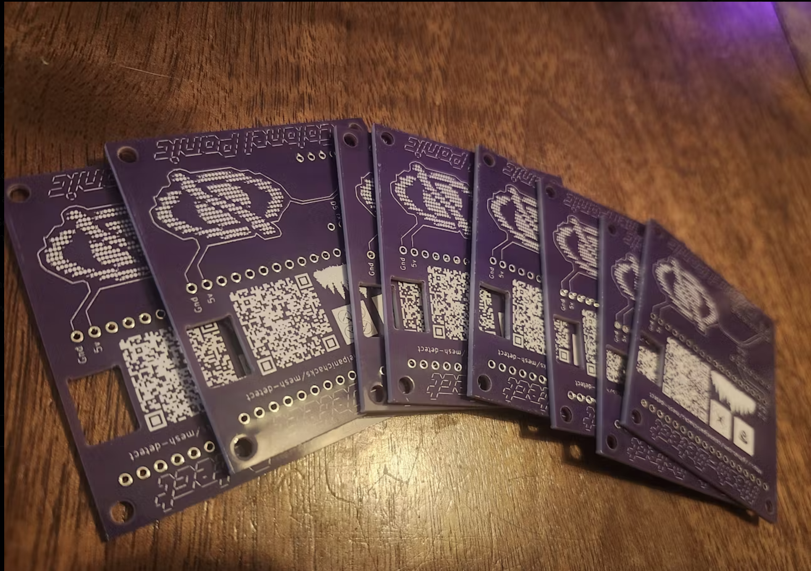

# <div align="center">**Drone Remote ID Mapper**</div>

<div align="center">

[](https://opensource.org/licenses/MIT)
[](https://www.python.org/)
[](https://www.espressif.com/)
[](https://flask.palletsprojects.com/)

**Real-time drone detection, mapping, and Remote ID compliance monitoring**

[Quick Start](#quick-start) | [Features](#features) | [API Reference](#api-reference) | [Hardware](#hardware-setup)


</div>

---

## **What's New**

The mapper now features a completely redesigned **dark cyber aesthetic** with:

- **Modern Dark Theme** - Deep backgrounds with cyber accent colors (cyan, magenta, green)
- **Orbitron & JetBrains Mono Fonts** - Futuristic display with monospace data readouts
- **Live View** - Real-time drone/pilot tracking with animated position rings
- **Historical View** - Session and cumulative KML data visualization with flight replay
- **Flight Replay System** - Watch historical flights animate in real-time with speed controls
- **Per-Drone Filtering** - Filter by MAC, OUI, alias, or date/time
- **Visibility Controls** - Show/hide individual drone tracks
- **Color Customization** - Per-drone track color sliders
- **FAA Integration** - Query FAA registration database with results cached and displayed
- **Aliasing System** - Set friendly names across all views (live, historical, replay)
- **Google Maps Links** - Quick access to view positions in Google Maps

---

## **Hardware Options**

### **Ready-to-Use Solution**
Pre-built detection hardware designed specifically for this project:

<a href="https://www.tindie.com/stores/colonel_panic/?ref=offsite_badges&utm_source=sellers_colonel_panic&utm_medium=badges&utm_campaign=badge_large">
    
</a>

**Complete kits with all components included**  
**Pre-flashed firmware ready to use**  


**Completely Standalone Operation**
- **No Raspberry Pi Required**: Boards operate independently for mesh detection
- **No Computer Needed**: Self-contained drone detection and mesh communication
- **Instant Setup**: Just power on and start detecting

**Optional Mapper Integration**
- **Standalone mesh detection** works great on its own
- **Add the mapper software** for enhanced visualization and logging
- **Best of both worlds**: Mesh detection + centralized monitoring

### **DIY Build Option**

Build your own detection system using readily available components:

**Required Components:**
- **Xiao ESP32-S3** (dual-core with WiFi + Bluetooth)
- **Heltec WiFi LoRa 32 V3** (for mesh networking)
- Basic wiring connections

**Perfect for:**
- Learning and experimentation
- Custom modifications
- Budget-conscious builds
- Educational projects

---

## **Overview**

Advanced drone detection system that captures and maps Remote ID broadcasts from drones using ESP32 hardware. Features real-time web interface with cyber-themed UI, persistent tracking across sessions, historical flight replay, and comprehensive data export capabilities.

---

## **Quick Start**

### **Installation**

1. **Clone repository**
   ```bash
   git clone https://github.com/colonelpanichacks/drone-mesh-mapper.git
   cd drone-mesh-mapper
   ```

2. **Install dependencies**
   ```bash
   cd drone-mapper
   pip3 install -r requirements.txt
   
   # Or use the dependency installer script
   python3 install_requiremants.py
   ```

3. **Flash ESP32 firmware**
   - Navigate to `remoteid-mesh-s3/` or `remoteid-node-mode-s3/` directory
   - Use PlatformIO to flash firmware:
     ```bash
     cd remoteid-mesh-s3
     pio run -e seeed_xiao_esp32s3 -t upload
     ```
   - Configure WiFi channel and mesh settings

4. **Run Mapper**
   ```bash
   cd drone-mapper
   python3 mesh-mapper.py
   ```
   
   The web interface will be available at `http://localhost:5000`

### **Auto-Start Setup (Linux)**

Use the cronstall script to automatically start the mapper on system reboot:

```bash
# Navigate to cronstall folder
cd drone-mapper/cronstall

# Install cron job (automatically finds mesh-mapper.py in parent directory)
python3 cron.py

# Or specify custom path to mesh-mapper.py
python3 cron.py --path /opt/mesh-mapper/drone-mapper/mesh-mapper.py
```

The cronstall script will:
- Automatically locate `mesh-mapper.py` in the parent directory
- Set up a cron job to start the mapper on every system reboot
- Configure proper paths and working directory

---

## **Core Features**

### **Live View - Real-time Mapping**
- **Live Detection Display**: Interactive map showing drone positions as they're detected
- **Flight Path Tracking**: Visual trails showing drone and pilot movement over time
- **Animated Position Rings**: Pulsing indicators for active drone positions
- **Multi-device Support**: Handle multiple ESP32 receivers simultaneously
- **Drone/Pilot Icons**: Distinct markers for drone and pilot locations
- **Color-coded Tracks**: Each drone gets a unique color (customizable)

### **Historical View - Flight History**
- **Session KML**: Current session detection data
- **Cumulative KML**: All historical data across sessions
- **Flight Replay**: Animate historical flights with adjustable speed (0.5x to 5x)
- **Per-Flight Filtering**: Select individual flights from dropdown
- **Start/End Markers**: Green circles for start, red circles for end positions
- **Auto-refresh**: Historical data updates automatically

### **Data Management**
- **Detection History**: Complete log of all drone encounters with timestamps
- **Device Aliases**: Assign friendly names to frequently seen drones
- **Alias Sync**: Aliases work across live, historical, and replay views
- **Alias Upload to ESP32**: Upload aliases directly to ESP32-S3 devices
- **Data Export**: Download as CSV, KML, or JSON

### **ESP32 Integration**
- **Auto-detection**: Automatically finds and connects to ESP32 devices
- **Port Management**: Save and restore USB port configurations
- **Status Monitoring**: Real-time connection health and data flow indicators
- **Command Interface**: Send diagnostic commands to connected hardware
- **Alias Storage**: ESP32-S3 devices store up to 200 aliases in NVS

### **Web Interface**
- **Dark Cyber Theme**: Modern aesthetic with cyber accent colors
- **Real-time Updates**: WebSocket-powered live data streaming
- **Mobile Responsive**: Works on desktop, tablet, and mobile devices
- **Multiple Views**: Live map, historical view, detection list, and device status

### **FAA Integration**
- **Remote ID Lookup**: Query FAA registration database
- **Cached Results**: Results displayed in popups and stored locally
- **Manufacturer Info**: Shows make, model, series, and tracking number

### **Configuration & Monitoring**
- **Headless Operation**: Run without web interface for dedicated deployments
- **Debug Logging**: Detailed logging for troubleshooting and development
- **Webhook Support**: External system integration via HTTP callbacks

---

## **Usage**

### **Command Line Options**

```bash
python3 mesh-mapper.py [OPTIONS]
```

| Option | Description | Default |
|--------|-------------|---------|
| `--headless` | Run without web interface | false |
| `--debug` | Enable debug logging | false |
| `--web-port PORT` | Web interface port | 5000 |
| `--port-interval SECONDS` | Port monitoring interval | 10 |
| `--no-auto-start` | Disable automatic port connection | false |

### **Examples**

```bash
# Standard operation with web interface
cd drone-mapper
python3 mesh-mapper.py

# Headless operation for dedicated server
cd drone-mapper
python3 mesh-mapper.py --headless --debug

# Custom web port with verbose logging
cd drone-mapper
python3 mesh-mapper.py --web-port 8080 --debug

# Disable auto-connection to saved ports
cd drone-mapper
python3 mesh-mapper.py --no-auto-start
```

---

## **API Reference**

### **Core Endpoints**

| Method | Endpoint | Description |
|--------|----------|-------------|
| `GET` | `/` | Main web interface |
| `GET` | `/api/detections` | Current active drone detections |
| `POST` | `/api/detections` | Submit new detection data |
| `GET` | `/api/detections_history` | Historical detection data (GeoJSON) |
| `GET` | `/api/paths` | Flight path data for visualization |
| `POST` | `/api/reactivate/<mac>` | Reactivate inactive drone detection |

### **Historical Data**

| Method | Endpoint | Description |
|--------|----------|-------------|
| `GET` | `/api/kml/session` | Current session KML data |
| `GET` | `/api/kml/cumulative` | Cumulative historical KML data |

### **Device Management**

| Method | Endpoint | Description |
|--------|----------|-------------|
| `GET` | `/api/aliases` | Get device aliases |
| `POST` | `/api/set_alias` | Set friendly name for device |
| `POST` | `/api/clear_alias/<mac>` | Remove device alias |
| `POST` | `/api/upload_aliases` | Upload aliases to ESP32-S3 devices |
| `GET` | `/api/ports` | Available serial ports |
| `GET` | `/api/serial_status` | ESP32 connection status |
| `GET` | `/api/selected_ports` | Currently configured ports |

### **FAA & External Integration**

| Method | Endpoint | Description |
|--------|----------|-------------|
| `GET` | `/api/faa/<identifier>` | FAA registration lookup |
| `POST` | `/api/query_faa` | Manual FAA query |
| `POST` | `/api/set_webhook_url` | Configure webhook endpoint |
| `GET` | `/api/get_webhook_url` | Get current webhook URL |

### **Data Export**

| Method | Endpoint | Description |
|--------|----------|-------------|
| `GET` | `/download/aliases` | Download device aliases as JSON |
| `GET` | `/download/csv` | Download current session detections as CSV |
| `GET` | `/download/kml` | Download current session detections as KML |
| `GET` | `/download/cumulative_detections.csv` | Download cumulative detections as CSV |
| `GET` | `/download/cumulative.kml` | Download cumulative detections as KML |

### **WebSocket Events**

Real-time events pushed to connected clients:

- `detections` - Updated drone detection data
- `detection` - Single drone detection update
- `paths` - Updated flight path data  
- `serial_status` - ESP32 connection status changes
- `aliases` - Device alias updates
- `faa_cache` - FAA lookup results
- `cumulative_log` - Cumulative detection log updates

---

## **Hardware Setup**

### **Supported ESP32 Boards**
- **Xiao ESP32-C3** (Single core, WiFi only)
- **Xiao ESP32-S3** (Dual core, WiFi + Bluetooth)  
- **ESP32-DevKit** (Development and testing)
- **Custom PCBs** (See Tindie store link)

### **Wiring for Mesh Integration**
```
ESP32 Pin | Mesh Radio Pin
----------|---------------
TX1 (d4)  | RX 19
RX1 (d5)  | TX 20
3.3V      | VCC
GND       | GND
```

---

## **Performance**

| Metric | Performance |
|--------|-------------|
| **Detection Latency** | < 500ms average |
| **Concurrent Drones** | 50+ simultaneous |
| **Memory Usage** | < 100MB typical |
| **Storage Efficiency** | ~1KB per detection |
| **Network Throughput** | 1000+ detections/min |

---

## **Project Structure**

```
drone-mesh-mapper/
├── drone-mapper/              # Main application folder
│   ├── mesh-mapper.py         # Main Python application
│   ├── requirements.txt       # Python dependencies
│   ├── install_requiremants.py # Dependency installer
│   └── cronstall/             # Auto-start setup scripts
│       └── cron.py            # Cron job installer for Linux
├── remoteid-mesh-s3/          # ESP32-S3 firmware (mesh mode)
│   ├── src/
│   │   └── main.cpp           # Firmware source code
│   └── platformio.ini         # PlatformIO configuration
├── remoteid-node-mode-s3/     # ESP32-S3 firmware (node mode)
│   ├── src/
│   │   └── main.cpp           # Firmware source code
│   └── platformio.ini         # PlatformIO configuration
├── .gitignore                 # Git ignore patterns
└── README.md                  # This file
```

---

## **Troubleshooting**

### **Common Issues**

**ESP32 Not Detected**
```bash
# Check USB connection
ls -la /dev/tty* | grep USB

# Verify driver installation  
dmesg | grep tty
```

**Web Interface Not Loading**
```bash
# Check if service is running
netstat -tlnp | grep :5000
```

**No Drone Detections**
- Verify ESP32 firmware is properly flashed
- Check WiFi channel configuration (default: channel 6)
- Ensure drones are transmitting Remote ID (required in many jurisdictions)

**Historical View Empty**
- Make sure drones have been detected and saved to KML
- Check that cumulative.kml exists in the drone-mapper directory
- Try switching between Session and All History views

---

## **License**

This project is licensed under the MIT License 

---

## **Acknowledgments**

- **Cemaxacutor** 
- **Luke Switzer** 
- **OpenDroneID Community** - Standards and specifications
- Thank you PCBway for the awesome boards! The combination of their top tier quality, competitive pricing, fast turnaround times, and stellar customer service makes PCBWay the go-to choice for professional PCB fabrication.
https://www.pcbway.com/

<div align="center">

</div>

---

## **Hardware Store**

Get professional PCBs and complete kits:

<a href="https://www.tindie.com/stores/colonel_panic/?ref=offsite_badges&utm_source=sellers_colonel_panic&utm_medium=badges&utm_campaign=badge_large">
    
</a>

---

<div align="center">

**If this project helped you, please give it a star!**

Made with love by the Drone Detection Community

</div>
