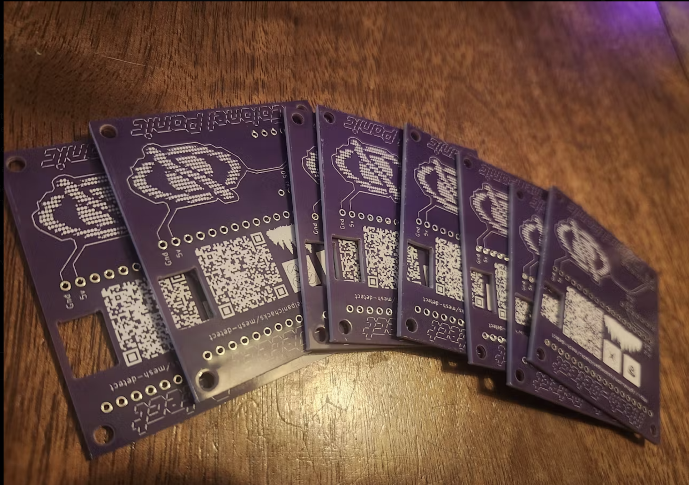

# <div align="center">**Drone Mesh Mapper**</div>

<div align="center">

[](https://opensource.org/licenses/MIT)
[](https://www.python.org/)
[](https://www.espressif.com/)
[](https://flask.palletsprojects.com/)

**Real-time drone Remote ID detection · Meshtastic LoRa relay · live web map · fully offline-capable**

[Quick Start](#quick-start) ·
[Features](#features) ·
[Offline Maps](#offline-maps) ·
[API Reference](#api-reference) ·
[Hardware](#hardware-setup)


</div>

---

## Overview

Captures FAA Remote ID broadcasts (BLE + WiFi) from drones using ESP32 nodes, relays detections over a Meshtastic LoRa mesh, and renders them in real time on a Leaflet web map. Optional FAA registration lookups, persistent multi-session tracking, KML/CSV/GeoJSON export, and **a fully self-contained offline mode** — UI, fonts, JS, and tiles all served from disk so you can pull the ethernet and still operate.

---

## Hardware Options

### Ready-to-Use Solution
Pre-built detection hardware designed specifically for this project, available at **[colonelpanic.tech](https://colonelpanic.tech)**:

- Complete kits with all components included
- Pre-flashed firmware ready to use
- Standalone mesh detection — no Pi or computer required
- Optional mapper integration for centralized monitoring

### DIY Build Option

| Component | Role |
|---|---|
| Xiao ESP32-S3 | Dual-core detection node (WiFi + BLE) |
| Heltec WiFi LoRa 32 V3 | Meshtastic relay |
| Wires | Three of them |

---

## Quick Start

### Automated (Raspberry Pi)
```bash
wget https://raw.githubusercontent.com/colonelpanichacks/drone-mesh-mapper/main/RPI/install_rpi.py
python3 install_rpi.py --branch main          # stable
python3 install_rpi.py --branch Dev           # latest
```

Optional flags: `--install-dir /opt/mesh-mapper`, `--no-cron`, `--force`.

### Manual
```bash
git clone https://github.com/colonelpanichacks/drone-mesh-mapper
cd drone-mesh-mapper
pip3 install -r requirements.txt
python3 mesh-mapper.py
```

### CLI flags
| Flag | Default | What it does |
|---|---|---|
| `--web-port PORT` | 5000 | Port for the web UI |
| `--headless` | off | No web interface (server-only) |
| `--debug` | off | Verbose logging |
| `--port-interval SEC` | 10 | USB port re-scan cadence |
| `--no-auto-start` | off | Don't auto-connect to saved ports |

### Firmware
Pick the variant that matches your board. All build with PlatformIO:

| Path | Target | Notes |
|---|---|---|
| `node-mode-dualcore/` | ESP32-S3 dual-core | Remote node + home dedup node (`pio run -e remote` / `-e home`) |
| `remoteid-mesh-dualcore/` | ESP32-S3 | BLE + WiFi concurrent detection, mesh relay |
| `remoteid-mesh/` | ESP32-S3 / single-core | Original variant, GPIO6/7 pinout |
| `remoteid-c5-5g/` | ESP32-C5 | UNII-3 5GHz WiFi RID (channels 149/153/157/161/165) |

```bash
cd remoteid-mesh-dualcore
pio run -t upload
```

---

## Features

### Real-time Mapping
- Live drone + pilot positions, broadcast rings, custom markers
- Flight-path tracking with persistent session state across restarts
- Multiple ESP32 receivers simultaneously
- Cyberpunk lime/magenta UI (Orbitron font, neon glow)

### Data Management
- Detection history with timestamps + RSSI
- Device aliases (friendly names per MAC)
- Export to CSV, KML (Google Earth), GeoJSON
- Cumulative long-term log

### ESP32 Integration
- USB serial auto-discovery + saved-port restore
- Real-time connection health
- Send diagnostic commands to connected nodes

### Web Interface
- WebSocket-driven live updates
- Mobile responsive
- Map / detection list / status panels in one view

### External
- FAA Remote ID registration lookup with 3-tier cache
- Webhook callbacks on detection transitions
- Service worker tile cache for the live UI

### DroneScout Bridge ds110 (BLE relay ingest)
- `tools/ds110_bridge.py` listens on the Mac's Bluetooth for the ds110's BT4 Legacy Remote ID relay (ODID service data, UUID 0xFFFA), decodes it, and POSTs to `/api/detections`
- Shows up as **DroneScout Bridge (BLE)** in the connection-status panel next to the USB nodes — it heartbeats `POST /api/receiver_status` every 15 s and flips to Disconnected after 45 s of silence
- Relayed drones are keyed by their original `basic_id` (synthesized MAC), so multiple drones relayed by one bridge stay separate map entries — the ESP32 BLE path tags them all with the bridge's advertiser MAC
- The bridge's idle self-advertisement (`DroneScout Bridge`) is filtered out in `update_detection()`
- Requires `bleak` (in `requirements.txt`). On macOS run it through `tools/ds110_bridge_macos.sh`: no stock Python declares `NSBluetoothAlwaysUsageDescription`, so a plain `python tools/ds110_bridge.py` is killed by TCC with SIGABRT the moment it touches CoreBluetooth. The script wraps the interpreter in a signed .app that declares the key and launches it via `open` (so macOS holds the bundle, not your terminal, responsible for the request) - you then get the normal Bluetooth permission prompt. The bundle is built under `venv/` and is disposable

```bash
./venv/bin/python mesh-mapper.py --web-port 5001   # 5000's loopback is taken by another app on this machine
./tools/ds110_bridge_macos.sh --list              # debug: print heard ODID ads
./tools/ds110_bridge_macos.sh                     # feed mapper at http://localhost:5001 (default; --url to override)
# non-macOS: ./venv/bin/python tools/ds110_bridge.py
```

### Offline Maps
- 8 raster tile sources, vendored Leaflet + MapLibre GL
- One-click world baseline, region presets, place search
- Drop-in MBTiles import (raster or vector)
- Page loads with **zero internet** once tiles are cached

### ADS-B Air Traffic
- 6 sources: adsb.lol, adsb.fi, airplanes.live, OpenSky, ADSBexchange, plus **native Beast TCP** (HackRF / RTL-SDR / AirSpy / SDRplay via dump1090 / readsb / tar1090 / PiAware)
- Live aircraft markers, heading-rotated triangles, altitude-banded colors
- Aircraft trails per ICAO (60-point history)
- Click any aircraft for callsign / ICAO / altitude / speed / heading / vertical rate / squawk
- Polite to providers — bbox-only mode, configurable interval, exponential backoff on errors

---

## Offline Maps

The mapper is built to run with no internet at all. Everything the UI needs — Leaflet, MapLibre GL, Socket.IO, the Orbitron font — is vendored under `static/`. Map tiles live in `tiles/` as standard MBTiles files. The server serves them, the browser renders them, and you fly.

### How it works in 30 seconds

```
+------------------+    /tiles/<name>/{z}/{x}/{y}.png    +------------------+
|   Leaflet (UI)   | <----------------------------------- |  Flask backend   |
+------------------+                                      |  + SQLite reader |
         |                                                +--------+---------+
         | XYZ tile request                                        |
         |                                                         v
         |                                                 tiles/area.mbtiles
         |                                                 (one row per tile)
```

Tiles are stored in MBTiles format (SQLite, one row per `(z, x, y, blob)`). The Flask `/tiles/<name>/<z>/<x>/<y>.<ext>` route flips XYZ to TMS and serves bytes. PBF vector tiles get `Content-Encoding: gzip` set so MapLibre decodes them transparently.

### The 8 built-in raster sources

| Dropdown name | Best for | Server | Max zoom | Bulk-cache OK? |
|---|---|---|---|---|
| **Esri World Imagery** | Satellite / actual ground | server.arcgisonline.com | 19 | yes |
| **Esri World Topo** | Hillshade + roads | server.arcgisonline.com | 19 | yes |
| **Esri Dark Gray** | Minimal dark canvas | server.arcgisonline.com | 16 | yes |
| **CartoDB Dark Matter** | Cyberpunk dashboards (matches UI) | basemaps.cartocdn.com | 20 | yes |
| **CartoDB Positron** | Light minimal — drone tracks pop | basemaps.cartocdn.com | 20 | yes |
| **OSM Standard** | Classic streets reference | tile.openstreetmap.org | 19 | NO — TOS forbids |
| **OSM Humanitarian** | Amenities, water, terrain emphasized | tile.openstreetmap.fr | 20 | low volume only |
| **OpenTopoMap** | Backcountry / contours / trails | tile.opentopomap.org | 17 | low volume only |

The cacher **respects each provider's TOS** — OSM main bulk caching is rejected by convention; use Esri/Carto for big jobs.

### Four ways to populate `tiles/`

#### 1. From the live map UI — Cache This Area

Open the **CACHE THIS AREA** panel in the sidebar:

```
PLACE SEARCH         type "Yosemite National Park", click result, bbox auto-fills
REGION PRESETS       pick from California / PNW / Continental US / 12 more
Source / Name / zMin / zMax    manual control
~ N tiles (~M MB)    live estimate while you adjust
START CACHE          kicks off a job, progress bar in sidebar
WORLD BASELINE       one-click globe overview at z0-6 (~80 MB) or z0-8 (~1.3 GB)
IMPORT MBTILES       paste URL or upload file
```

#### 2. Region Presets (one-click)

Built-in operational areas. Selecting one pans + auto-fills the cache name:

| Preset | bbox |
|---|---|
| California | [-125, 32, -114, 42] |
| Pacific Northwest (OR/WA) | [-125, 42, -117, 49] |
| Eastern Sierra | [-120, 37, -117, 40] |
| Continental US | [-125, 24.5, -66.9, 49.4] |
| New England | [-74, 40, -66, 47.5] |
| Appalachian Trail corridor | [-85, 30, -76, 39] |
| Florida / Texas / Hawaii / Alaska | ... |
| United Kingdom / Germany (west) / Japan | ... |

Add more by editing the `<select id="regionPreset">` block in `mesh-mapper.py`.

#### 3. From the CLI — `tools/cache_tiles.py`

```bash
# Single area, single source
python tools/cache_tiles.py \
    --bbox -122.6 37.6 -122.3 37.9 \
    --zoom 0 16 \
    --source esriWorldImagery \
    --out tiles/bay_area.mbtiles

# Globe baseline, every source (8 mbtiles files)
python tools/cache_tiles.py --preset world --source all --out tiles/

# Multi-source for one bbox (writes one mbtiles per source)
python tools/cache_tiles.py --preset world \
    --source esriWorldImagery,cartoDarkMatter,openTopoMap \
    --out tiles/

# Just count tiles, don't fetch
python tools/cache_tiles.py --preset world --source all --out tiles/ --dry-run
```

| Preset | bbox | zooms | tiles/source |
|---|---|---|---|
| `world` | global | 0-6 | ~5,500 |
| `world-z5` | global | 0-5 | ~1,400 |
| `world-z8` | global | 0-8 | ~88,000 |

The CLI is **resumable** — re-running skips tiles already in the MBTiles. Polite to free providers (50ms between fetches by default; tunable with `--rate`).

#### 4. Drop in a prebuilt file

Anything in standard MBTiles format works. Just copy it into `tiles/` and refresh.

| Source | Type | Notes |
|---|---|---|
| https://data.maptiler.com/downloads/ | raster + vector | Free tier with signup |
| https://openmaptiles.com/downloads/ | vector | Some free samples; commercial planet |
| Self-built with `tilemaker` | raster/vector | Geofabrik OSM extract to tiles |
| OpenMapTiles Docker pipeline | vector | https://github.com/openmaptiles/openmaptiles |

### Vector tile support (OpenMapTiles schema)

Drop a vector `.mbtiles` (format: pbf) in `tiles/` and it appears tagged **[V]** in the dropdown. Renders through MapLibre GL using the bundled cyberpunk style at [`static/styles/default-dark.json`](static/styles/default-dark.json).

```
[R] my_satellite (240 MB)    raster, served by Leaflet
[V] world_vector (52 MB)     vector, rendered by MapLibre GL
```

**Caveat**: the default style ships **without text labels** because glyph PBFs are bulky. Drop OpenMapTiles glyphs into `static/glyphs/<fontstack>/<range>.pbf` and add a `"glyphs"` key to the style JSON to enable place names.

### Recommended "hit the woods" loadout

Two raster mbtiles + one vector overview, totaling ~1 GB:

```bash
# 1. Globe-wide cyberpunk baseline (UI matches)
python tools/cache_tiles.py --preset world --source cartoDarkMatter --out tiles/

# 2. Satellite imagery for your AO
python tools/cache_tiles.py \
    --bbox -120.0 37.5 -119.0 38.5 \
    --zoom 8 16 \
    --source esriWorldImagery \
    --out tiles/op_zone_sat.mbtiles

# 3. Topo for terrain context
python tools/cache_tiles.py \
    --bbox -120.0 37.5 -119.0 38.5 \
    --zoom 8 14 \
    --source openTopoMap \
    --out tiles/op_zone_topo.mbtiles
```

Then pull the ethernet, refresh the page, switch the basemap dropdown — page renders entirely from disk.

### Place Search

Powered by [Nominatim](https://nominatim.openstreetmap.org/). Type a place name, get bbox results in the panel, click to apply. Respects Nominatim TOS (one req/sec max, meaningful User-Agent, results cached locally).

> Place search **requires internet** at search time. Cache the area first, then go offline. Region presets are 100% offline.

---

## ADS-B Air Traffic

Optional layer overlaying live aircraft on top of the drone RID feed. Six sources, ranging from zero-setup to "I have a HackRF in the woods":

### Network sources (no setup, just internet)

| Source | Free | Key | Notes |
|---|---|---|---|
| **adsb.lol** | yes | no | Default; community-run, generous limits |
| **adsb.fi** | yes | no | Alternate provider, same JSON shape |
| **airplanes.live** | yes | no | Another community feed |
| **OpenSky Network** | yes | optional auth | Anonymous tier ~100 req/day, auth raises it |
| **ADS-B Exchange** | paid | RapidAPI key | Bring your own key |

### Local SDR sources (HackRF, RTL-SDR, AirSpy, SDRplay)

| Source | How |
|---|---|
| **Local SDR (JSON)** | Polls `dump1090` / `readsb` / `tar1090` / `PiAware` HTTP JSON. URL presets included for each common setup. Path of least resistance if you already have any running. |
| **Beast TCP (native)** | Direct TCP connect to a raw Mode-S Beast feed (default port 30005). Decodes in-process via [pyModeS](https://github.com/junzis/pyModeS). Requires `pip install pyModeS`. Eliminates the need for a separate web frontend. |

### Quick paths

```bash
# Easiest: pick adsb.lol in the dropdown, hit SAVE — done

# HackRF / RTL-SDR + dump1090 (JSON path)
sudo apt install dump1090-fa
# UI: pick "Local SDR · HackRF" preset → SAVE

# HackRF / RTL-SDR + Beast (native, no web frontend)
pip install pyModeS
dump1090-fa --net --net-bo-port 30005 --device-type hackrf
# UI: source = "Beast TCP raw feed", host=localhost, port=30005 → SAVE
```

### Behavior
- Heading-rotated triangle markers, altitude-banded colors (red <1k → violet 35k+ ft)
- Aircraft trails: 60-point polyline history per ICAO, color matches current altitude
- Stale aircraft (>60 sec since last seen) auto-evicted
- Polite: configurable poll interval (2-120 sec), bbox-restricted queries, exponential backoff on upstream errors
- Config persisted to `adsb_config.json`; auto-resumes on restart

---

## API Reference

### Detections
| Method | Endpoint | Description |
|---|---|---|
| `GET` | `/` | Main web interface |
| `GET` | `/api/detections` | Current active drone detections |
| `POST` | `/api/detections` | Submit new detection data |
| `GET` | `/api/detections_history` | Historical detection data (GeoJSON) |
| `GET` | `/api/paths` | Flight path data for visualization |
| `POST` | `/api/reactivate/<mac>` | Reactivate inactive drone detection |

### Device Management
| Method | Endpoint | Description |
|---|---|---|
| `GET` | `/api/aliases` | Get device aliases |
| `POST` | `/api/set_alias` | Set friendly name for device |
| `POST` | `/api/clear_alias/<mac>` | Remove device alias |
| `GET` | `/api/ports` | Available serial ports |
| `GET` | `/api/serial_status` | ESP32 connection status |
| `GET` | `/api/selected_ports` | Currently configured ports |

### FAA & Webhooks
| Method | Endpoint | Description |
|---|---|---|
| `GET` | `/api/faa/<identifier>` | FAA registration lookup |
| `POST` | `/api/query_faa` | Manual FAA query |
| `POST` | `/api/set_webhook_url` | Configure webhook endpoint |
| `GET` | `/api/get_webhook_url` | Get current webhook URL |
| `POST` | `/api/webhook_popup` | Webhook notification handler |

### ADS-B Air Traffic
| Method | Endpoint | Description |
|---|---|---|
| `GET` | `/api/adsb/sources` | List sources + dump1090 URL presets |
| `GET` | `/api/adsb/config` | Current config (credentials masked) |
| `POST` | `/api/adsb/config` | Update config (`enabled`, `source`, `interval`, `bbox`, source-specific fields) |
| `GET` | `/api/adsb/aircraft` | Current aircraft snapshot |

WebSocket event: `adsb` — pushed every poll cycle when enabled.

### Offline Tiles & Maps
| Method | Endpoint | Description |
|---|---|---|
| `GET` | `/tiles/<name>/<z>/<x>/<y>.<ext>` | Serve a tile from `<name>.mbtiles` (png/jpg/webp/pbf) |
| `GET` | `/styles/<name>.json` | Auto-generated MapLibre style JSON for a vector layer |
| `GET` | `/api/offline_layers` | List discovered MBTiles + format / kind / size / zoom range |
| `DELETE` | `/api/offline_layers/<name>` | Delete a cached layer |
| `POST` | `/api/cache_tiles` | Start a tile cache job (`{name, source, bbox, zmin, zmax}`) |
| `GET` | `/api/cache_jobs` | List all cache jobs |
| `GET` | `/api/cache_jobs/<id>` | Job progress + status |
| `POST` | `/api/cache_jobs/<id>/cancel` | Request cancel |
| `POST` | `/api/import_mbtiles` | Import via JSON `{name, url}` (download) or multipart upload |
| `GET` | `/api/import_jobs/<id>` | Import progress |
| `POST` | `/api/import_jobs/<id>/cancel` | Cancel import |
| `GET` | `/api/geocode?q=<query>` | Nominatim place search proxy (cached + rate-limited) |

### Data Export
| Method | Endpoint | Description |
|---|---|---|
| `GET` | `/download/csv` | Current detections (CSV) |
| `GET` | `/download/kml` | Current detections (KML) |
| `GET` | `/download/aliases` | Device aliases |
| `GET` | `/download/cumulative_detections.csv` | Full history (CSV) |
| `GET` | `/download/cumulative.kml` | Full history (KML) |

### System
| Method | Endpoint | Description |
|---|---|---|
| `GET` | `/api/diagnostics` | System health and performance |
| `POST` | `/api/debug_mode` | Toggle debug logging |
| `POST` | `/api/send_command` | Send command to ESP32 devices |
| `GET` / `POST` | `/select_ports` | Port selection interface |

### WebSocket Events
Pushed to connected clients in real time:
`detections`, `paths`, `serial_status`, `aliases`, `cumulative_log`, `faa_cache`

---

## Hardware Setup

### Supported ESP32 Boards
- **Xiao ESP32-S3** — Dual core, WiFi + BLE (recommended)
- **Xiao ESP32-C3** — Single core, WiFi only
- **Xiao ESP32-C5** — UNII-3 5GHz support
- **ESP32-DevKit** — Development & testing
- **Custom PCBs** — available at [colonelpanic.tech](https://colonelpanic.tech)

### Wiring for Mesh Integration
```
ESP32 Pin | Heltec V3 Pin   | Notes
----------|-----------------|------
TX1 (D4)  | RX 19           | Detection node -> mesh
RX1 (D5)  | TX 20           | Mesh -> home node
3.3V      | VCC             |
GND       | GND             |
```

> **`remoteid-mesh` variant uses GPIO6/7 instead** — check the firmware's `platformio.ini` before wiring.

### Heltec V3 Meshtastic Config (one-time)
```
serial.enabled  true
serial.mode     TEXTMSG
serial.baud     BAUD_115200
serial.rxd      19
serial.txd      20
```

---

## Performance

| Metric | Value |
|---|---|
| Detection latency | < 500ms |
| Concurrent drones | 50+ simultaneous |
| Memory (mapper) | < 100 MB typical |
| Per-detection storage | ~1 KB |
| Detections/min | 1000+ |
| Vendored UI assets | ~1.1 MB total (Leaflet + MapLibre + Socket.IO + Orbitron) |
| Tile cache rate | ~20 tiles/sec (50ms throttle, polite) |

---

## Troubleshooting

### ESP32 not detected
```bash
ls -la /dev/tty* | grep -E 'USB|ACM'
dmesg | grep tty
```
Hold the BOOT button while plugging in if the device shows up but won't program.

### Web interface won't load
```bash
netstat -tlnp | grep :5000     # is the server up?
tail -f mapper.log             # what's it saying?
```

### No drone detections
- Confirm firmware is flashed and running (`pio device monitor`)
- Verify the WiFi channel matches what your local drones broadcast on (default ch 6)
- Check that the Heltec is in serial mode at 115200, RX=19, TX=20
- Some drones don't broadcast Remote ID — required in many jurisdictions but not universal

### Tile cache job stuck
- Check `/api/cache_jobs/<id>` for `errors` count — likely upstream rate-limiting
- Bump `--rate` in `tools/cache_tiles.py` (e.g. `--rate 0.2` = 5 tiles/sec)
- OSM main server will silently throttle; use Esri/Carto for bulk

### Vector layer renders blank / weird
- Default style targets the OpenMapTiles schema; other schemas (Tilezen, Protomaps) need a custom style JSON
- Check the browser console — MapLibre logs unknown layer-source mismatches there
- Verify the mbtiles `metadata.format` is `pbf`

### Offline mode shows online tiles
- Pick a layer tagged `[R]` or `[V]` in the basemap dropdown — those are the offline ones
- The 8 named sources (Esri / Carto / OSM / etc.) are **online** layers; their dropdown labels do not have the `[R]`/`[V]` prefix

---

## Project Layout

```
drone-mesh-mapper/
|-- mesh-mapper.py              # Flask + SocketIO server, all UI inline
|-- requirements.txt
|-- static/                     # Vendored UI assets (offline-capable)
|   |-- leaflet/                # Leaflet 1.9.4
|   |-- maplibre/               # MapLibre GL 4.7.1 + leaflet plugin
|   |-- socketio/               # Socket.IO client
|   |-- fonts/                  # Orbitron TTF + @font-face CSS
|   `-- styles/                 # MapLibre vector styles
|-- tiles/                      # MBTiles files (auto-discovered)
|   `-- README.md               # Tile import / format notes
|-- tools/
|   |-- cache_tiles.py          # CLI tile pre-cacher
|   `-- ds110_bridge.py         # DroneScout Bridge ds110 BLE relay -> /api/detections
|-- RPI/                        # Raspberry Pi installer scripts
|-- node-mode-dualcore/         # ESP32-S3 dual-role firmware
|-- remoteid-mesh-dualcore/     # ESP32-S3 BLE+WiFi firmware
|-- remoteid-mesh/              # Single-core mesh firmware
|-- remoteid-c5-5g/             # ESP32-C5 5GHz firmware
`-- firmware/                   # Additional firmware variants
```

---

## Hardware Store

Get professional PCBs and complete kits at **[colonelpanic.tech](https://colonelpanic.tech)**.

---

## License

MIT — see [LICENSE](LICENSE).

## Acknowledgments

- **Cemaxecuter** / **alphafox02** — original RID firmware
- **Luke Switzer** — firmware contributions
- **OpenDroneID** community — protocol & specs (Apache 2.0)
- **OpenStreetMap**, **Esri**, **CARTO**, **OpenTopoMap** — tile providers
- **MapLibre GL** + **Leaflet** + **Nominatim** — open mapping stack
- **ADS-B receivers** — built on the shoulders of [dump1090](https://github.com/MalcolmRobb/dump1090) (Malcolm Robb / mutability), [readsb](https://github.com/wiedehopf/readsb) + [tar1090](https://github.com/wiedehopf/tar1090) (wiedehopf), and [pyModeS](https://github.com/junzis/pyModeS) (junzis) for Mode-S/CPR decode. The Beast TCP path uses pyModeS directly; the JSON path is compatible with all of the above. Network sources: [adsb.lol](https://adsb.lol), [adsb.fi](https://adsb.fi), [airplanes.live](https://airplanes.live), [OpenSky](https://opensky-network.org), [ADSBexchange](https://adsbexchange.com).
- **PCBway** — top-tier PCB fabrication, fast turnaround, stellar service. Your one-stop for prototyping innovative mesh detection hardware or scaling for production. https://www.pcbway.com/

<div align="center"></div>

---

<div align="center">

If this project helped you, give it a star.

</div>
